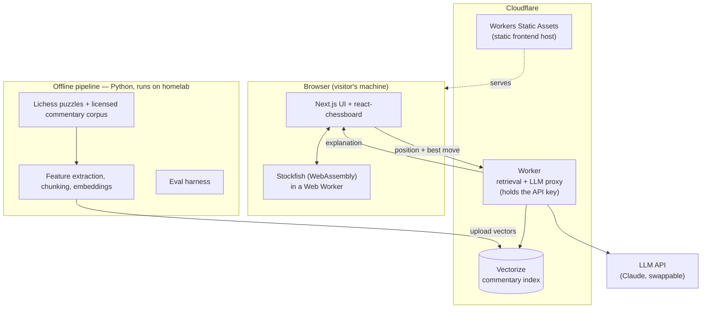

# Chess Explanation Engine

A retrieval-augmented system that explains chess positions in plain English. Given a
board, it reports the best move and *why* that move is good — grounded in a chess
engine's evaluation and a corpus of human commentary, not in a language model's unaided
guesswork.

## The problem it solves

Language models are fluent but unreliable at chess: they propose illegal moves and invent
justifications that sound convincing but are wrong. This project constrains the model to a
translation role. It never reasons about chess on its own. It converts verifiable facts
into readable prose, which is what keeps the explanations honest.

## How it works

Every explanation is assembled from two trustworthy sources:

- **Engine facts.** Stockfish supplies the best move and a numerical evaluation of the
  position. This is treated as ground truth and is never overridden.
- **Retrieved commentary.** Relevant human annotations are fetched from a vector database
  and supplied to the model as context.

The language model's only job is to weave these into a clear explanation. Because it works
from supplied facts rather than memory, hallucination is suppressed.

## Architecture



The engine runs client-side as WebAssembly, so the heaviest compute happens free on each
visitor's machine. The backend is a thin serverless function whose only responsibilities
are holding the API key, retrieving commentary, and calling the model.

## The pipeline (five stages)

1. **Input** — a position, expressed as FEN (a one-line text encoding of a board).
2. **Engine** — Stockfish returns the best move and an evaluation. Ground truth.
3. **Feature extraction** — the board is converted into describable facts (open files,
   an exposed king, a fork) using python-chess plus light model tagging. This is the
   bridge that makes retrieval possible.
4. **Retrieval** — those features are used to fetch matching human commentary from the
   vector index.
5. **Synthesis** — the model combines the position, the engine's facts, and the retrieved
   commentary into a plain-English explanation.

## Evaluation

The evaluation harness is the distinguishing feature of the project, and it is possible
because each Lichess puzzle ships with an answer key (the correct move and a tag such as
`fork` or `pin`). For every puzzle the harness checks three things:

- **Legality** — is the recommended move legal? Automatic, via python-chess.
- **Move match** — does it equal the puzzle's solution? Automatic, via string compare.
- **Explanation correctness** — does the prose identify and correctly apply the right
  tactic? Graded by a language-model judge that is first validated against a
  hand-labelled sample.

Legality and move-match mainly verify that the plumbing works. The explanation score is
the real signal. The headline result is explanation accuracy measured **with versus
without** retrieval, which shows whether the RAG layer earns its place.

## Tech stack

| Layer | Choice |
| --- | --- |
| Frontend | Next.js (App Router), React, shadcn/ui, Tailwind, react-chessboard |
| Chess engine | Stockfish compiled to WebAssembly, run in a Web Worker (client-side) |
| Backend | Cloudflare Worker (retrieval + LLM proxy) |
| Vector store | Cloudflare Vectorize |
| Hosting | Cloudflare Workers Static Assets (Next.js static export), free tier |
| Language model | Claude (Haiku by default), behind a provider-agnostic proxy |
| Offline pipeline | Python with uv, ruff, pytest, python-chess, native Stockfish |
| Embeddings | Local sentence-transformers or Cloudflare Workers AI |

## Repository layout

```
.
├── pipeline/   Python. Offline data processing, feature extraction,
│               embeddings, and the evaluation harness. Never runs in production.
├── vision/     Python (separate uv project). Board-recognition subproject:
│               generated training data, per-square CNN, ONNX export for the
│               in-browser screenshot scan.
├── web/        TypeScript. The live application (Next.js frontend + Cloudflare Worker).
├── docs/       Design docs — ARCHITECTURE.md is the definitive system design.
├── CLAUDE.md   Shared project context and conventions.
└── README.md
```

Each of `pipeline/`, `vision/`, and `web/` carries its own `CLAUDE.md` so per-language
conventions stay separated.

## Data sources

- **Lichess puzzle database** (~6M puzzles, CC0). Serves as both the position source and
  the evaluation answer key: each entry gives a FEN, the solution moves, and theme tags.
- **Commentary corpus** (clean-licensed): Chess Stack Exchange Q&A (CC BY-SA 4.0,
  displayed with attribution), public-domain annotated classics (Capablanca,
  Ed. Lasker), and Lichess studies used for grounding only (their text is never
  displayed). The GAMEKNOT research dataset was evaluated and ruled out for the
  public site on licensing grounds.
- **PGN game collections** (Lichess Elite database) for additional positions.

Raw data is not committed to the repository. Only small test fixtures are tracked.

## Cost

Standing infrastructure cost is approximately zero: the frontend is static, the engine
runs in the browser, and the backend and vector store sit within free tiers. The only
metered cost is language-model tokens — a few dollars for demo traffic, and a one-time
budget on the order of tens of dollars for evaluation sweeps (reduced with prompt caching
and the Batch API).

## Development

The offline pipeline is compute-heavy (parsing millions of puzzles, running native
Stockfish, generating embeddings) and is intended to run on a dedicated machine, reached
over Tailscale. The web application is developed locally and deployed to the Cloudflare
free tier.

## Build order

1. Engine plus model explainer, with no corpus. Self-verifying from day one through a
   legality check.
2. The evaluation harness, scored against puzzle theme tags.
3. Retrieval, then measurement of the with-versus-without delta.
